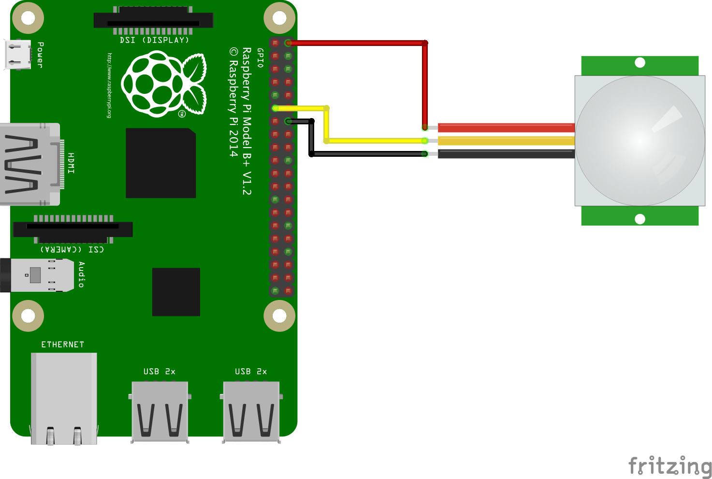

Raspberry Pi with PIR motion sensor
===



```
echo 17 >/sys/class/gpio/export
echo in >/sys/class/gpio/gpio17/direction
chown root.gpio /sys/class/gpio/gpio17/value
chmod 660 /sys/class/gpio/gpio17/value

echo gpio >/sys/class/leds/led0/trigger
echo 17 >/sys/class/leds/led0/gpio
```
